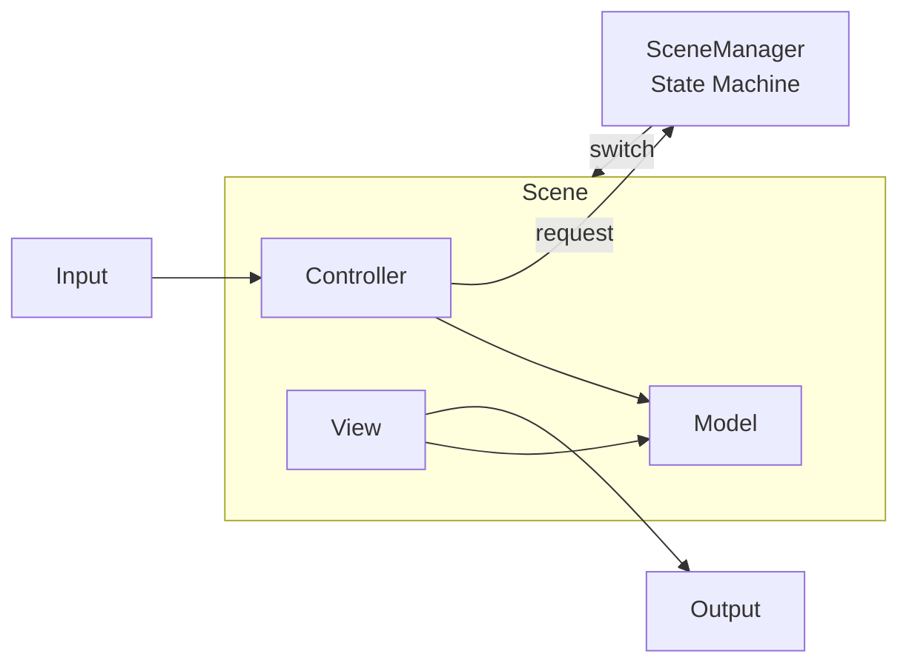
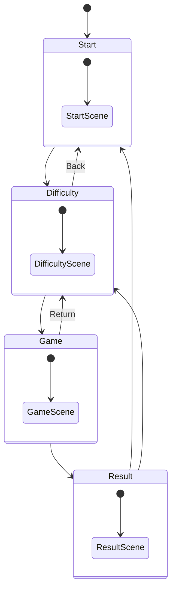
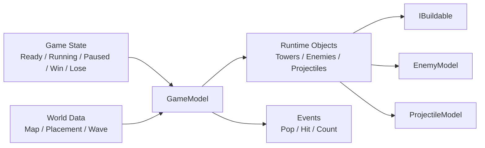

# 2026 OOPL Final Report

## 組別資訊

組別：T20

組員：111590450 陶冠丞

復刻遊戲：bloons tower defense 2

## 專案簡介
### 遊戲簡介
Bloons Tower Defense 2，簡稱 BTD2，是 Ninja Kiwi 製作的經典塔防遊戲，也是 Bloons TD 系列的第二代作品。遊戲最早在 2007 年 10 月左右以 Flash 網頁遊戲形式推出，屬於早期很有代表性的瀏覽器塔防遊戲。

遊戲的核心玩法是：玩家要在地圖道路旁放置猴子塔、防禦塔或道具，阻止一波又一波的氣球，也就是 Bloons，走到終點。每打破氣球可以獲得金錢，再用這些錢購買新的塔或升級現有防禦。
### 組別分工
我獨自升級
## 遊戲介紹
### 遊戲規則
玩家要阻止氣球沿著固定路線走到終點。
如果氣球成功走到終點，玩家會扣生命值；生命值歸零就遊戲失敗。玩家必須撐過全部 50 回合 才算勝利。
#### 生命值規則
不同難度的初始生命值不同 ：
| 難度     | 地圖特色        | 初始生命值 |
| ------ | ----------- | ----: |
| Easy   | 路線較彎曲，較容易防守 |   100 |
| Medium | 路線稍短，難度中等   |    75 |
| Hard   | 雙路線且較難防守    |    50 |

#### 氣球規則
|氣球類型|英文|敘述|RBE|
|-----|----|-------|--|
|紅氣球 |red bloon| 最基本，一下就破|1|
|藍氣球 |blue bloon| 打破後變紅氣球|2|
|綠氣球 |green bloon|打破後變藍氣球|3|
|黃氣球 |yellow bloon| 速度非常快，打破後變綠氣球|4|
|黑氣球 |black bloon| 較小，打破後分裂成兩顆黃氣球，免疫爆炸|9|
|白氣球 |white bloon|較小且速度較快，打破後分裂成兩顆黃氣球，免疫冰凍|9|
|鉛氣球 |lead bloon| 一般飛鏢打不破，需要炸彈爆破，打破後分裂成兩顆黑氣球|19|
|彩虹氣球 |rainbow bloon| 速度較快，打破後會分裂成兩顆黑氣球和白氣球|37|
>RBE=Red Bloon Equivalent 等價紅氣球數量
#### 防禦塔規則
| 防禦塔               | 簡介                |特殊設定|
| ----------------- | ----------------- |--------|
| Dart Monkey       | 基本塔，向氣球丟飛鏢|N/A|
| Tack Shooter      | 向多方向發射釘子，適合放在彎道|N/A|
| Ice Tower         | 凍結氣球，讓氣球暫時停止移動|被凍結的氣球無法被打破|
| Cannon     | 發射砲彈，適合對付鉛氣球或群體氣球|可以打破鉛氣球和凍結的氣球|
| Boomerang | 丟出迴旋鏢，可攻擊路線上的氣球|可以打破兩顆氣球|
| Super Monkey      | 高攻速、高輸出，但價格較高|射速飛快|
>防禦塔可以升級
#### 陷阱塔規則
|陷阱塔|簡介|
|----|------|
|Road Spikes|擺在路上的尖刺，刺破氣球，可以觸發10次|
|Monkey Glue|猴子在路上的...額(膠水)，對氣球緩速，可以觸發20次|
>陷阱塔不能升級，每回合結束後失效

#### 塔升級規則
| 防禦塔        | 升級選項       | 效果                           |
| ------------ | ------------------ | -------------------------------- |
| Dart Monkey  | Piercing Darts     | +1 pierce                        |
|              | Long Range Darts   | +25 range                        |
| Tack Shooter | Faster Shooting    | -15 cooldown                     |
|              | Extra Range Tacks  | +10 range, +30% projectile size  |
| Ice Ball     | Long Freeze Time   | +20 freeze duration              |
|              | Wide Freeze Radius | +15 range  |
| Cannon | Bigger Bombs       | +50% projectile size |
|              | Extra Range Bombs  | +range                        |
| Boomerang    | Multi Target       | +3 pierce                        |
|| Sonic Boom         | 可以打破凍結狀態的氣球                |
| Super Monkey | Epic Range         | +100 range                       |
|| Laser Vision       | +1 pierce，可以打破凍結狀態的氣球      |


### 遊戲畫面
* 遊戲初始畫面

* 難易度選擇畫面

* 遊戲主畫面

* 選塔、建塔、升級塔、賣塔畫面

* 遊玩畫面

* 結算畫面(勝利)

* 結算畫面(失敗)

## 程式設計

### 程式架構
#### 架構總覽：最外層FSM切換場景，場景皆為MVC架構

#### FSM 架構：透過狀態機分離場景，避免過耦合

#### 遊戲邏輯核心：負責管理遊戲狀態、地圖與放置資料、執行中的塔/敵人/子彈，以及提供給 View 顯示用的事件資料


### 程式技術
1. MVC Pattern

整體架構是HMVC(Hierarchical-Model-View-Controller)，最上層由 SceneManager 管理不同 Scene，而每個 Scene 內部再依職責拆成 Model、View、Controller，以達到低耦合和模組重用性。
```
Scene
├── Model      資料 / 狀態
├── View       畫面 / UI
└── Controller 輸入 / 指令
```
2. State Pattern

把不同遊戲流程狀態拆成獨立類別，來達到「解耦複雜條件分支（if-else/switch），並讓遊戲狀態能自主管理其行為與切換」。
```
IGameState
├── ReadyState
├── RoundRunningState
├── PausedState
├── WinState
└── LoseState
```
3. Command Pattern

將玩家操作（建造、升級、變賣等）全面物件化，藉此消除臃腫的條件分支，實現 UI 表現層與核心邏輯層的完全解耦。
```
ICommand
├── SelectBuildableCommand
├── StartRoundCommand
├── SellTowerCommand
├── UpgradeTowerCommand
└── ReturnToDifficultyCommand
```
4. Factory Pattern

玩家選擇某個塔時，只要根據 id 找到 factory，就能建立對應的塔。
GameModel 不需要直接知道每個塔的具體類別，降低耦合。
```
BuildableRegistry
├── tower id
├── factory function
└── create IBuildable
```
5. Singleton Pattern

這些物件全域唯一，資源管理、塔註冊資料、和波次設定。
Singleton 避免重複載入資料，也方便不同系統共用同一份設定。
```
ResourceManager
BuildableRegistry
WaveConfig
```

### 使用到 AI/AI Agent 的部分

開發過程中有使用codex和chatgpt輔助，主要架構設計、程式設計與整合仍由本人完成。AI Agent 主要用於架構分析、程式重構建議、設計模式判斷、Debug 方向整理，以及報告內容與架構圖的輔助產生。

1. **協助導入 Design Patterns**  
   設計的pattern都是由我構想，並透過AI Agent更快的完成部分需要花費大量時間除錯且複雜的pattern，例如 GameModel 的 State Pattern、UI 操作的 Command Pattern、BuildableRegistry 的 Factory Pattern。原本的設計就是以此為方向，但透過AI可以更快的完成這些設計，讓程式更容易維護與擴充。

2. **協助設計塔、陷阱與子彈的 OOP 繼承架構**  
   AI Agent 協助整理各種塔、陷阱與子彈的共通行為，並輔助設計 IBuildable、TowerBase、AttackTowerBase、TrapBase、ProjectileModel 等架構。透過繼承與多型，不同塔與子彈可以共用介面，但各自實作不同攻擊方式。

3. **協助 Debug 與修正遊戲流程問題**  
   在建塔、升級、賣塔、敵人生成、回合切換與勝敗判斷等功能上，AI Agent 協助分析錯誤原因並提供修正方向，幫助我更快定位問題，也讓 GameModel、GameView、GameController 的分工更清楚。

4. **協助產生報告架構圖與技術說明**  
   AI Agent 協助將程式碼整理成報告可用的架構圖與文字說明，例如 SceneManager 狀態機、HMVC、GameModel 組織架構、塔與陷阱繼承架構、Command Pattern 與 Factory Pattern。這讓報告內容更完整，也更容易讓讀者理解程式設計。
## 結語

### 問題與解決方法
#### 1. 降低耦合

一開始在實作遊戲功能時，許多邏輯都是直接用 if-else 或 switch-case 寫在一起。雖然這樣可以快速完成基本功能，但隨著場景切換、玩家操作、建塔、升級、賣塔、回合狀態等功能越來越多，程式碼開始變得混亂，也讓不同功能之間的耦合度變高。每次要修改一個功能時，都可能需要到很多地方檢查條件式，閱讀和維護上都變得比較困難。

後來我重新複習陳偉凱老師課堂中提到的 design pattern 與 孫老師的OOP，將這些大量條件判斷透過適合的設計模式來整理。因此我將部分邏輯重新拆分，讓不同類別負責不同職責，降低彼此之間的依賴。

例如，遊戲流程狀態拆成 ReadyState、RoundRunningState、PausedState、WinState、LoseState，避免 GameModel 裡充滿判斷目前狀態的 if-else；玩家操作則改成 Command Pattern，將選塔、開始回合、升級、賣塔、返回等操作封裝成不同 Command 類別；塔與陷阱的建立則透過 BuildableRegistry 搭配 Factory Pattern，使 GameModel 不需要直接知道每個具體塔類別。

這樣修改後，程式的責任分工變得比較清楚。GameModel 專注於遊戲資料與規則，Controller 負責輸入與指令，View 負責畫面顯示，SceneManager 負責場景切換。雖然程式類別數量變多，但每個類別的目的更明確，也讓後續新增功能或修改邏輯時比較不容易影響其他部分。
#### 2. 地圖路徑和回合設計
一開始在設計地圖路徑和回合時，我是直接用 case-switch 和 if-else 寫在主要遊戲邏輯中。初期關卡數量還不多時，這樣寫還可以接受，但後來要設計完整 50 回合時，程式裡開始出現大量地圖座標、氣球種類與生成順序，導致 GameModel 變得很雜亂，也讓後續調整難度或新增路線變得不方便。

為了解決這個問題，我後來將地圖路徑與回合資料從主要遊戲邏輯中分離出來，讓 GameModel 不直接寫死所有地圖座標與敵人波次，而是透過 MapModel 管理路徑資料，透過 WaveConfig 管理每回合的敵人組合。

MapModel 負責保存不同難度對應的路徑資料，例如 Easy、Medium、Hard 可以有不同路線設計；WaveConfig 則負責保存 50 回合中每一回合要生成的氣球種類與順序。GameModel 只需要在回合開始時取得目前回合的 wave 設定，並依照設定生成敵人即可。

這樣修改後，GameModel 的職責變得比較單純，只需要負責遊戲流程、敵人生成與物件更新，而地圖資料和回合資料則交給專門的類別管理。未來如果要調整某一關的氣球數量、修改地圖路線，或新增不同難度的地圖，就不需要在 GameModel 裡面翻找大量 if-else，只要修改 MapModel 或 WaveConfig 即可。
#### 3. 異常狀態重複紀錄
因為遊戲裡有冰凍、緩速、爆炸、穿透這些效果，如果沒有記錄同一個敵人是否已經被這次攻擊處理過，就可能出現重複扣血或重複產生特效的問題。所以我用 hit enemies 或 affected enemies 這類集合記錄已處理過的敵人，避免同一次攻擊重複作用。另外，Model 產生的事件在交給 View 後會被 consume 掉，避免下一幀又重複播放同一個特效。
### 自評

| 項次 | 項目 | 完成 |
|------|------|------|
| 1 | 完成 BTD2 基本塔防玩法：建塔、敵人移動、扣血、勝敗判斷 | V |
| 2 | 完成 Start、Difficulty、Game、Result 四個主要場景 | V |
| 3 | 完成 SceneManager 狀態機切換場景 | V |
| 4 | 每個 Scene 皆具有 MVC 分工概念 | V |
| 5 | 完成多種防禦塔與陷阱塔 | V |
| 6 | 完成塔的升級與賣塔功能 | V |
| 7 | 完成多種氣球敵人與分裂規則 | V |
| 8 | 完成不同難度與不同地圖設定 | V |
| 9 | 導入 State Pattern 管理遊戲流程狀態 | V |
| 10 | 導入 Command Pattern 管理玩家操作 | V |
| 11 | 導入 Factory / Singleton Pattern 管理塔的建立 | V |
| 12 | 使用繼承、多型、封裝等 OOP 技術設計塔與子彈系統 | V |
| 13 | 具有 Debug / Cheat Mode 輔助測試功能 | V |
| 14 | 報告包含程式架構圖與設計模式說明 | V |
| 15 | 專案權限已改為 public，並附上 README 與遊戲畫面 | V |

### 心得
### 貢獻比例
我獨自升級
